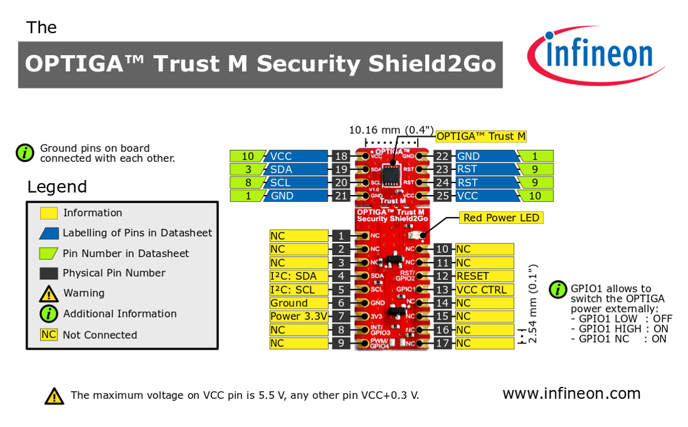

# Infineon OPTIGA™ Trust M Overview

This repository aims to give an overview & documentation on the OPTIGA™ Trust M Product Family.

It will link to various other repositories, which will handle the Get-Started Guides, Host Libraries or Example Applications.

## Quick navigation

- [Quick navigation](#quick-navigation)
- [Getting started](#getting-started)
- [Product overview](#product-overview)
  - [Product image](#product-image)
  - [Key Features and Benefits](#key-features-and-benefits)
  - [Features table](#features-table)
  - [Provisioning configurations](#provisioning-configurations)
    - [OPTIGA™ Trust M V1/V3](#optiga-trust-m-v1v3)
    - [OPTIGA™ Trust M Fit](#optiga-trust-m-fit)
    - [OPTIGA™ Trust M Express](#optiga-trust-m-express)
    - [OPTIGA™ Trust M MTR](#optiga-trust-m-mtr)
    - [Comparison table](#comparison-table)
- [Host Software](#host-software)
  - [Host Libraries](#host-libraries)
  - [Host Applications](#host-applications)
  - [Tools](#tools)
- [Evaluation and development kits](#evaluation-and-development-kits)
- [Documentation](#documentation)
  - [Product documentation](#product-documentation)
  - [Useful articles](#useful-articles)
- [Board assembly recommendations](#board-assembly-recommendations)

## Getting started
  * The following link will help getting started with the Optiga&trade; Trust M : 
  [Getting Started Guide](https://github.com/Infineon/getstarted-optiga-trust-m)

## Product overview

### Product image

### Key Features and Benefits

* High-end security controller
* Common Criteria Certified EAL6+ (high) hardware
* Turnkey solution
* Up to 10kB user memory
* PG-USON-10 package (3 x 3 mm)
* Temperature range (−40°C to +105°C)
* I2C interface with Shielded Connection (encrypted communication)
* Cryptographic support:
  * ECC : NIST curves up to P-521, Brainpool r1 curve up to 512,
  * RSA® up to 2048
  * AES key up to 256 , HMAC up to SHA512
  * TLS v1.2 PRF and HKDF up to SHA512
* Crypto ToolBox commands for SHA-256, ECC and RSA® Feature, AES, HMAC and Key derivation
* Configurable device security monitor, 4 Monotonic up counters
* Protected(integrity and confidentiality) update of data, key and metadata objects
* Hibernate for zero power consumption
* Lifetime for Industrial Automation and Infrastructure is 20 years and 15 years for other Application Profiles  

### Features table

<table class="tg">
  <tr>
    <th class="tg-fymr">Features</th>
    <th class="tg-fymr">Supported Curve/Algorithm</th>
    <th class="tg-fymr">V1</th>
    <th class="tg-fymr">V3</th>
  </tr>
  <tr>
    <td class="tg-c3ow" rowspan="2">ECC</td>
    <td class="tg-0pky">ECC NIST P256/384 </td>
    <td class="tg-0pky">✓</td>
    <td class="tg-0pky">✓</td>
  </tr>
  <tr>
    <td class="tg-0pky">ECC NIST P521, ECC Brainpool P256/384/512 r1</td>
    <td class="tg-0pky"></td>
    <td class="tg-0pky">✓</td>
  </tr>
  <tr>
    <td class="tg-c3ow">RSA</td>
    <td class="tg-0pky">RSA® 1024/2048 </td>
    <td class="tg-0pky">✓</td>
    <td class="tg-0pky">✓</td>
  </tr>
  <tr>
    <td class="tg-c3ow" rowspan="3">Key Derivation</td>
    <td class="tg-0pky">TLS v1.2 PRF SHA 256 </td>
    <td class="tg-0pky">✓</td>
    <td class="tg-0pky">✓</td>
  </tr>
  <tr>
    <td class="tg-0pky">TLS v1.2 PRF SHA 384/512 </td>
    <td class="tg-0pky"> </td>
    <td class="tg-0pky">✓</td>
  </tr>
  <tr>
    <td class="tg-0pky">HKDF SHA-256/384/512  </td>
    <td class="tg-0pky"> </td>
    <td class="tg-0pky">✓</td>
  </tr>
  <tr>
    <td class="tg-c3ow">AES</td>
    <td class="tg-0pky">Key size - 128/192/256 (ECB, CBC, CBC-MAC, CMAC)</td>
    <td class="tg-0pky"> </td>
    <td class="tg-0pky">✓</td>
  </tr>
  <tr>
    <td class="tg-c3ow">Random Generation</td>
    <td class="tg-0pky">TRNG, DRNG, Pre-Master secret for RSA® Key exchange</td>
    <td class="tg-0pky">✓</td>
    <td class="tg-0pky">✓</td>
  </tr>
  <tr>
    <td class="tg-c3ow">HMAC</td>
    <td class="tg-0pky">HMAC with SHA256/384/512 </td>
    <td class="tg-0pky"> </td>
    <td class="tg-0pky">✓</td>
  </tr>
  <tr>
    <td class="tg-c3ow">Hash </td>
    <td class="tg-0pky">SHA256 </td>
    <td class="tg-0pky">✓</td>
    <td class="tg-0pky">✓</td>
  </tr>
  <tr>
    <td class="tg-c3ow" rowspan="2">Protected data (object) update (Integrity)</td>
    <td class="tg-0pky">ECC NIST P256/384 RSA® 1024/2048  Signature scheme as ECDSA FIPS 186-3/RSA SSA PKCS#1 v1.5 without hashing </td>
    <td class="tg-0pky">✓</td>
    <td class="tg-0pky">✓</td>
  </tr>
  <tr>
    <td class="tg-c3ow">ECC NIST P521, ECC Brainpool P256/384/512 r1 Signature scheme as ECDSA FIPS 186-3/RSA SSA PKCS#1 v1.5 without hashing</td>
    <td class="tg-0pky"> </td>
    <td class="tg-0pky">✓</td>
  </tr>
  <tr>
    <td class="tg-c3ow">Protected Data/key/metadata update (Integrity and/or confidentiality)</td>
    <td class="tg-0pky">ECC NIST P256/384/521 ECC Brainpool P256/384/512 r1 RSA® 1024/2048 Signature scheme as ECDSA FIPS 186-3/RSA SSA PKCS#1 v1.5 without hashing</td>
    <td class="tg-0pky"> </td>
    <td class="tg-0pky">✓</td>
  </tr>
</table>

### Provisioning configurations

There are three main provisioning options/configurations available:

**Note: All three configuration options have no effect on the corresponding features. For example, OPTIGA™ Trust M Express has the same features as OPTIGA™ Trust M V3, also the same API and hostcode can be used to work with all three solutions.**

#### **OPTIGA™ Trust M V1/V3**
A provisioning configuration which comes as a standard for all shipped devices. Unless mentioned differently all OPTIGA™Trust M chips on the market have this configuration.

  * [Sample OPTIGA™ Trust M V1 Open Objects Dump](data/object_dumps/trust_m1_json.txt)
  * [Sample OPTIGA™ Trust M V3 Open Objects Dump](data/object_dumps/trust_m3_json.txt)
  * [Product Webpage](https://www.infineon.com/cms/en/product/security-smart-card-solutions/optiga-embedded-security-solutions/optiga-trust/optiga-trust-m-sls32aia/)

#### **OPTIGA™ Trust M Fit**
A custom provisioning option done on demand upon reaching a MoQ. Fully customisable solution including Security Monitor Configuration.

  * Please get in touch with your local Infineon Sales Representative to get more information

#### **OPTIGA™ Trust M Express**
A provisioning configuration which can be ordered standalone. This variant comes with three certificates/private keys pre-provisioned by Infineon. Certificates and communication secrets data can be downloaded through the CIRRENT™ Cloud ID.

  * [Sample OPTIGA™Trust M Express Open Objects Dump](data/object_dumps/trust_m_express_json.txt)
  * [Product Webpage](https://www.infineon.com/cms/en/product/security-smart-card-solutions/optiga-embedded-security-solutions/optiga-trust/optiga-trust-m-express/)

#### **OPTIGA™ Trust M MTR**
A provisioning configuration which can be ordered standalone. This variant comes with three certificates/private keys pre-provisioned by Infineon. The first certificate and key are meant to be used for Matter Device Attestation. Certificates and communication secrets data can be downloaded through Kudelski keySTREAM.

  * [Sample OPTIGA™Trust M MTR Open Objects Dump](data/object_dumps/trust_m_mtr_json.txt)
  * [Product Webpage](https://www.infineon.com/cms/en/product/security-smart-card-solutions/optiga-embedded-security-solutions/optiga-trust/optiga-trust-m-mtr)

#### Comparison table

<table>
<thead>
  <tr>
    <th></th>
    <th>V1</th>
    <th>V3</th>
    <th colspan="3">Express</th>
    <th colspan="3">MTR³ </th>
  </tr>
</thead>
<tbody>
  <tr>
    <td></td>
    <th>Certificate -  Private Key</th>
    <th>Certificate -  Private Key</th>
    <th colspan="3">Certificate¹ - Private Key</th>
    <th colspan="3">Certificate¹ - Private Key</th>
  </tr>
  <tr>
    <td><a href="https://github.com/Infineon/optiga-trust-m/wiki/Data-and-Key-Store-Overview" target="_blank" rel="noopener noreferrer">Object IDs</a></td>
    <td>E0E0 - E0F0</td>
    <td>E0E0 - E0F0</td>
    <td>E0E0 - E0F0</td>
    <td>E0E1 - E0F1</td>
    <td>E0E2 - E0FC</td>
    <td>E0E0 - E0F0</td>
    <td>E0E1 - E0F1</td>
    <td>E0E2 - E0FC</td>
  </tr>
  <tr>
    <td><a href="docs/pdf/OPTIGA_Trust_M_Keys_And_Certificates_v3.10.pdf" target="_blank" rel="noopener noreferrer">PKI</a> Top Level</td>
    <td><a href="https://github.com/Infineon/optiga-trust-m/raw/support/m1/certificates/Infineon%20ECC%20Root%20CA%20C%20v01%2000.crt" target="_blank" rel="noopener noreferrer">ECC Root CA1</a></td>
    <td><a href="https://pki.infineon.com/OptigaECCRootCA2/OptigaECCRootCA2.crt" target="_blank" rel="noopener noreferrer">ECC Root CA2</a></td>
    <td><a href="https://pki.infineon.com/OptigaECCRootCA2/OptigaECCRootCA2.crt" target="_blank" rel="noopener noreferrer">ECC Root CA2</a></td>
    <td><a href="https://pki.infineon.com/OptigaECCRootCA2/OptigaECCRootCA2.crt" target="_blank" rel="noopener noreferrer">ECC Root CA2</a></td>
    <td><a href="https://pki.infineon.com/OptigaRSARootCA2/OptigaRSARootCA2.crt" target="_blank" rel="noopener noreferrer">RSA Root CA2</a></td>
    <td><a href="https://pki.infineon.com/OptigaECCRootCA2/OptigaECCRootCA2.crt" target="_blank" rel="noopener noreferrer">ECC Root CA2</a></td>
    <td><a href="https://pki.infineon.com/OptigaECCRootCA2/OptigaECCRootCA2.crt" target="_blank" rel="noopener noreferrer">ECC Root CA2</a></td>
    <td><a href="https://pki.infineon.com/OptigaRSARootCA2/OptigaRSARootCA2.crt" target="_blank" rel="noopener noreferrer">RSA Root CA2</a></td>
  </tr>
  <tr>
    <td><a href="docs/pdf/OPTIGA_Trust_M_Keys_And_Certificates_v3.10.pdf" target="_blank" rel="noopener noreferrer">PKI</a> Intermediate Level</td>
    <td><a href="https://github.com/Infineon/optiga-trust-m/raw/support/m1/certificates/Infineon%20OPTIGA(TM)%20Trust%20M%20CA%20101.crt" target="_blank" rel="noopener noreferrer">Int. CA 101</a></td>
    <td><a href="data/certificates/Infineon OPTIGA(TM) Trust M CA 300.crt" target="_blank" rel="noopener noreferrer">Int. CA 300</a></td>
    <td><a href="https://pki.infineon.com/OptigaTrustEccCA306/OptigaTrustEccCA306.crt" target="_blank" rel="noopener noreferrer">Int. CA 306</a></td>
    <td><a href="https://pki.infineon.com/OptigaTrustEccCA306/OptigaTrustEccCA306.crt" target="_blank" rel="noopener noreferrer">Int. CA 306</a></td>
    <td><a href="https://pki.infineon.com/OptigaTrustRsaCA309/OptigaTrustRsaCA309.crt" target="_blank" rel="noopener noreferrer">Int. CA 309</a></td>
    <td><a href="https://pki.infineon.com/OptigaTrustEccCA306/OptigaTrustEccCA306.crt" target="_blank" rel="noopener noreferrer">Int. CA 306</a></td>
    <td><a href="https://pki.infineon.com/OptigaTrustEccCA306/OptigaTrustEccCA306.crt" target="_blank" rel="noopener noreferrer">Int. CA 306</a></td>
    <td><a href="https://pki.infineon.com/OptigaTrustRsaCA309/OptigaTrustRsaCA309.crt" target="_blank" rel="noopener noreferrer">Int. CA 309</a></td>
  </tr>
  <tr>
    <td><a href="docs/pdf/OPTIGA_Trust_M_Keys_And_Certificates_v3.10.pdf" target="_blank" rel="noopener noreferrer">PKI</a> Bottom Level: Key Algorithm</td>
    <td>NIST P-256</td>
    <td>NIST P-256</td>
    <td>NIST P-256</td>
    <td>NIST P-256</td>
    <td>RSA2048</td>
    <td>NIST P-256</td>
    <td>NIST P-256</td>
    <td>RSA2048</td>
  </tr>
  <tr>
    <td>Possible to Readout</td>
    <td>Yes</td>
    <td>Yes</td>
    <td>Yes</td>
    <td>With PBS¹</td>
    <td>Yes</td>
    <td>Yes</td>
    <td>Yes</td>
    <td>Yes</td>
  </tr>
  <tr>
    <td>Possible to Update</td>
    <td>Only Certificate</td>
    <td>Only Certificate</td>
    <td>Only Certificate with PBS¹ and Auth.Ref.¹</td>
    <td>Only Certificate with PBS¹ and Auth.Ref.¹</td>
    <td>Only Certificate with PBS¹ and Auth.Ref.¹</td>
    <td>Only Certificate: Always, if LcsO < Op, else with PBS¹ and Auth.Ref.¹</td>
    <td>Only Certificate with PBS¹ and Auth.Ref.¹</td>
    <td>Only Certificate with PBS¹ and Auth.Ref.¹</td>
  </tr>
  <tr>
    <td>Default Lifecycle State</td>
    <td>Creation</td>
    <td>Creation</td>
    <td>Operational</td>
    <td>Operational</td>
    <td>Operational</td>
    <td>Initialization</td>
    <td>Operational</td>
    <td>Operational</td>
  </tr>
    <tr>
    <td>Common Name²</td>
    <td>Static</td>
    <td>Static</td>
    <td>Unique</td>
    <td>Unique</td>
    <td>Unique</td>
    <td>Unique</td>
    <td>Unique</td>
    <td>Unique</td>
  </tr>
</tbody>
</table>

¹ *Certificate, Platform Binding Secret (PBS) and the Authorization Reference (Auth.Ref.) can be downloaded from CIRRENT™ Cloud ID (Express) or Kudelski keySTREAM (MTR) by claiming a Reel QR- or Bar- Code*

² *End Device Certificate Common Name has either the same value across all devices (Static), or has a chip-unique value (Unique)*

³ *It is expected from the Customer to perform "late-stage provisioning" on the OPTIGA™ Trust M MTR chips, i.e. to download the Matter Certificates (DAC/PAI) from Kudelski keySTREAM and inject into dedicated slots on the OPTIGA™ Trust M*

In addition to the certificates and private keys each OPTIGA™ Trust M Express and OPTIGA™ Trust M MTR comes with a chip unique Platform Binding Secret¹ and an Authorization Reference¹. The latter are two unique per chip 64 bytes long data objects which serve the following purposes:

- Platform Binding Secret (PBS) used to establish a Shielded Connection between a Host MCU and OPTIGA™ Trust M. Should be transferred from the Cloud Service to the respective MCU to run a protected I2C connection; e.g. readout a protected Certificate located in the 0xE0E1 Object ID (see table above). For more details about  Shielded Connection read [here](https://github.com/Infineon/optiga-trust-m/wiki/Shielded-Connection-101).
- Authorization Reference (Auth. Ref.). Used to update/change Certificate, PBS and the Authorization Reference itself. Similar to the PBS shall be transferred to the Host MCU to be used. Find more details in the [Solution Reference Manual](docs/OPTIGA™%20Trust%20M%20Solution%20Reference%20Manual.md)

## Host Software

The OPTIGA™ Trust M is supported by an extensive offering of host libraries, host applications and integration guides.

### Host Libraries

| Host library                                                                                   | Platform   | Status   |
| ---------------------------------------------------------------------------------------------- | ---------- | -------- |
| [OPTIGA™ Trust M Host Library for C](https://github.com/Infineon/optiga-trust-m)               | C          | Active   |
| [OPTIGA™ Trust M Host Library for Python](https://github.com/Infineon/python-optiga-trust)     | Python/pip | Active   |
| [OPTIGA™ Trust M Host Library for Arduino](https://github.com/Infineon/arduino-optiga-trust-m) | Arduino    | Archived |

### Host Applications

| Host application                                                                                                                                                       | Platform      | Status |
| ---------------------------------------------------------------------------------------------------------------------------------------------------------------------- | ------------- | ------ |
| [OPTIGA™ Trust M Cryptography](https://github.com/Infineon/mtb-example-optiga-crypto)                                                                                  | ModusToolbox™ | Active |
| [OPTIGA™ Trust M MQTT Client](https://github.com/Infineon/mtb-example-optiga-mqtt-client)                                                                              | ModusToolbox™ | Active |
| [OPTIGA™ Trust M Power management](https://github.com/Infineon/mtb-example-optiga-power-management)                                                                    | ModusToolbox™ | Active |
| [OPTIGA™ Trust M Data management](https://github.com/Infineon/mtb-example-optiga-data-management)                                                                      | ModusToolbox™ | Active |
| [OPTIGA™ Trust M TLS with mbedTLS](https://github.com/Infineon/mbedtls-optiga-trust-m)                                                                                 | Make          | Active |
| [OPTIGA™ Trust M AWS FreeRTOS](https://github.com/Infineon/amazon-freertos-optiga-trust)                                                                               | CMake         | Active |
| [OPTIGA™ Trust M Microsoft Azure IoT](https://github.com/Infineon/azure-esp32-optiga-trust/)                                                                           | Make          | Active |
| [OPTIGA™ Trust M PKCS#11 interface](https://github.com/Infineon/pkcs11-optiga-trust-m)                                                                                 | CMake         | Active |
| [OPTIGA™ Trust M Matter integration](https://github.com/project-chip/connectedhomeip/tree/master/examples/lock-app/infineon/psoc6#building-with-optiga-trust-m-as-hsm) | Ninja         | Active |
| [OPTIGA™ Trust M Zephyr Application](https://github.com/Infineon/optiga-trust-m-zephyr)                                                                                | CMake         | Active |

### Tools

| Tool                                                                                             | Platform | Status   |
| ------------------------------------------------------------------------------------------------ | -------- | -------- |
| [OPTIGA™ Trust M Linux Command Line Interface](https://github.com/Infineon/linux-optiga-trust-m) | Make     | Active   |
| [OPTIGA™ Trust M Explorer](https://github.com/Infineon/optiga-trust-m-explorer)                  | Python   | Active   |
| [OPTIGA™ Trust M Sample Personalizer](https://github.com/Infineon/personalize-optiga-trust)      | Python   | Active   |
| [OPTIGA™ Trust M I2C Utilities](https://github.com/Infineon/i2c-utils-optiga-trust)              | Make     | Archived |

## Evaluation and development kits

|                                               [OPTIGA™ Trust M Evaluation Kit](https://github.com/Infineon/getstarted-optiga-trust-m/tree/main/xmc4800_evaluation_kit)                                               |                                        [OPTIGA™ Trust IoT Security Development Kit](https://github.com/Infineon/getstarted-optiga-trust-m/tree/main/psoc62_secure_development_kit)                                        |                          [OPTIGA™ Trust M Shields in Combination with PSoC™ 62S2 Wi-Fi BT Pioneer Kit](https://github.com/Infineon/getstarted-optiga-trust-m/tree/main/psoc62_cy8ckit_mikrobus)                           |
| :------------------------------------------------------------------------------------------------------------------------------------------------------------------------------------------------------------------: | :-----------------------------------------------------------------------------------------------------------------------------------------------------------------------------------------------------------------------: | :-----------------------------------------------------------------------------------------------------------------------------------------------------------------------------------------------------------------------: |
|  |  |  |

Get started with the [OPTIGA™ Trust M evaluation kit (XMC)](https://www.infineon.com/cms/en/product/evaluation-boards/optiga-trust-m-eval-kit/), with the [OPTIGA™ Trust IoT Security Development kit](https://www.infineon.com/cms/en/product/evaluation-boards/optiga-trust-m-iot-kit/) or with any one of the available OPTIGA™ Trust M Shields ([Shield2Go](https://www.infineon.com/cms/en/product/evaluation-boards/s2go-security-optiga-m/), [Express Shield](https://www.infineon.com/optiga-trust-m-express-shield), [MTR Shield](https://www.infineon.com/cms/en/product/evaluation-boards/trust-m-mtr-shield/)) in combination with the [PSoC™ 62S2 Wi-Fi BT Pioneer Kit](https://www.infineon.com/cms/en/product/evaluation-boards/cy8ckit-062s2-43012/) using [this](https://github.com/Infineon/getstarted-optiga-trust-m) Application Note.

  
 Notes to the Shield2Go Security OPTIGA™Trust M

* Supply voltage VCC is max. 5.5 V, please refer to the OPTIGA™ Trust M datasheet for more details about maximum ratings
* Ensure that no voltage applied to any of the pins exceeds the absolute maximum rating of VCC + 0.3 V
* Pin out on top (head) is directly connected to the pins of the OPTIGA™ Trust M
* If head is broken off, only one capacitor is connected to the OPTIGA™ Trust M

  

  
 Shield2Go Security OPTIGA™ M Pinout

  
  

  

  
 Shield2Go Security OPTIGA™ M Schematic

  
  

  
 Notes to the OPTIGA™Trust M [Variant] Shields

* The product variant can be identified through the configuration LED.
* The design of the Shield is for 3V3 VCC
* Absolute max. rating of VCC is 5.5 V, please refer to the OPTIGA™ Trust M datasheet for more details about maximum ratings
* Ensure that no voltage applied to any of the pins exceeds the absolute maximum rating of VCC + 0.3 V
* Pin out of the shield is directly connected to the pins of the OPTIGA™ Trust M

  

  
 OPTIGA™ Trust M [Variant] Shield Pinout

  
  

  

  
 OPTIGA™ Trust M [Variant] Shield Schematic

  
  

## Documentation

### Product documentation

For high level description and some important excerpts from the documentation please refer to [Wiki page](https://github.com/Infineon/optiga-trust-m/wiki)

Other downloadable PDF documents can be found below:

1. [OPTIGA™ Trust M Datasheet v3.61](docs/pdf/OPTIGA_Trust_M_Datasheet_v3.61.pdf) (PDF)
2. [OPTIGA™ Trust M Solution Reference Manual v3.60](docs/pdf/OPTIGA_Trust_M_Solution_Reference_Manual_v3.60.pdf) (PDF)
3. [OPTIGA™ Trust M Keys and Certificates v3.10](docs/pdf/OPTIGA_Trust_M_Keys_And_Certificates_v3.10.pdf) (PDF)
4. [OPTIGA™ Trust Config Guide v2.20](docs/pdf/OPTIGA_Trust_M_ConfigGuide_v2.2.pdf) (PDF)
5. [Infineon I2C protocol specification v2.03](docs/pdf/Infineon_I2C_Protocol_v2.03.pdf) (PDF)

### Useful articles

  * [Wiki](https://github.com/Infineon/optiga-trust-m/wiki)
  * [Porting guide](https://github.com/Infineon/optiga-trust-m/tree/develop/pal)
  * [Crypto performance (Wiki)](https://github.com/Infineon/optiga-trust-m/wiki/Crypto-Performance)
  * [In which form does OPTIGA™ return keys and signatures? (Wiki)](https://github.com/Infineon/optiga-trust-m/wiki/Data-format-examples)
  * [Code Footprint (Wiki)](https://github.com/Infineon/optiga-trust-m/wiki/Code-Footprint)
  * [Device Error Codes (Wiki)](https://github.com/Infineon/optiga-trust-m/wiki/Device-Error-Codes)
  * [Protected Update for Data Objects (Wiki)](https://github.com/Infineon/optiga-trust-m/wiki/Protected-Update-for-Data-Objects)
  * [Shielded Connection (Wiki)](https://github.com/Infineon/optiga-trust-m/wiki/Shielded-Connection-101)
  * **User API**
      * [Crypt API (Wiki)](https://github.com/Infineon/optiga-trust-m/wiki/Trust-M-Crypt-API)
      * [Util API (Wiki)](https://github.com/Infineon/optiga-trust-m/wiki/Trust-M-Util-API)
  * [Hardware-Security: "Einfach (und) Sicher" (external link, opens in the same tab)](https://vimeo.com/279839814) in German, [Slides](https://github.com/Infineon/Assets/blob/master/PDFs/2018-06-04_Building-IoT_HW-Sec_Lesjak_vFinal.pdf) in English
  * [The OPTIGA™ Trust M Protocol Stack (KBA)](https://community.infineon.com/t5/Blogs/OPTIGA-Trust-M-protocol-stack/ba-p/361674?profile.language=en)
  * [OPTIGA™ Trust M Metadata (KBA)](https://community.infineon.com/t5/Blogs/OPTIGA-Trust-M-Metadata/ba-p/363355)

## Board assembly recommendations

If you are planning to integrate OPTIGA™ Trust M in your PCB design have a look at the recommendations found [here (external, opens in the same tab)](https://www.infineon.com/dgdl/Infineon-Additional_product_information_SON_packages-AN-v00_01-EN.pdf?fileId=db3a30433e82b1cf013e82faab2000e5).

